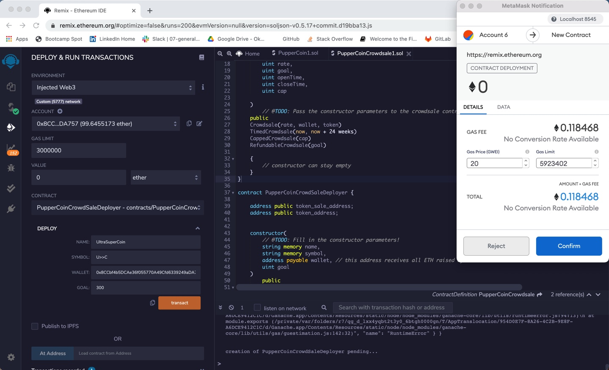
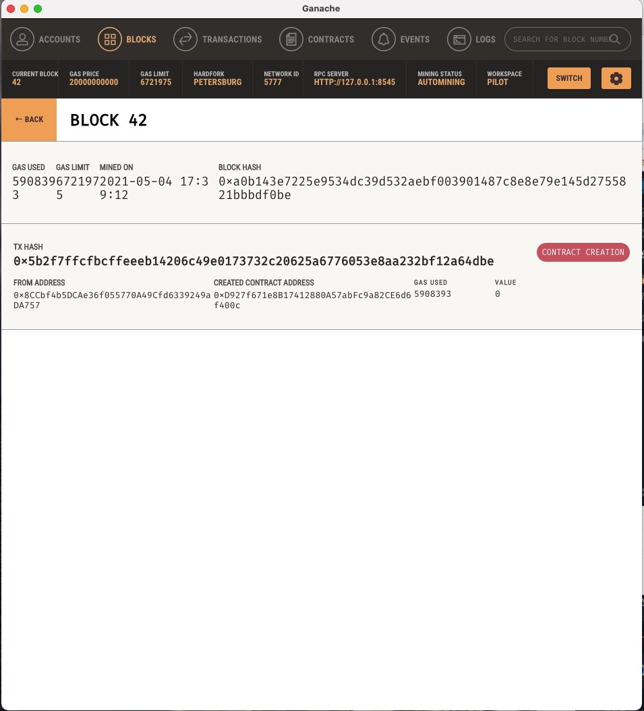
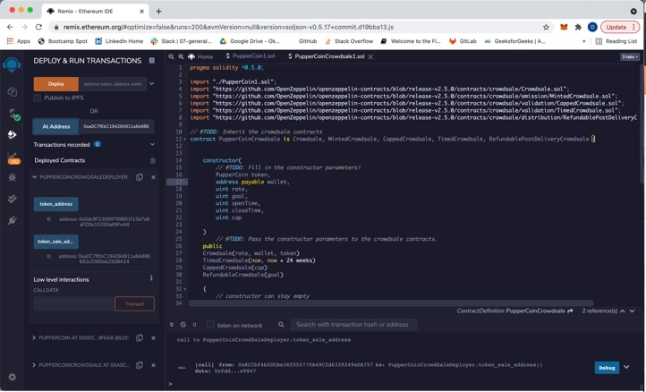
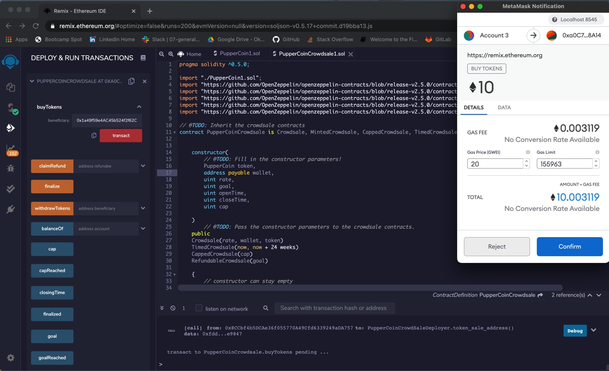
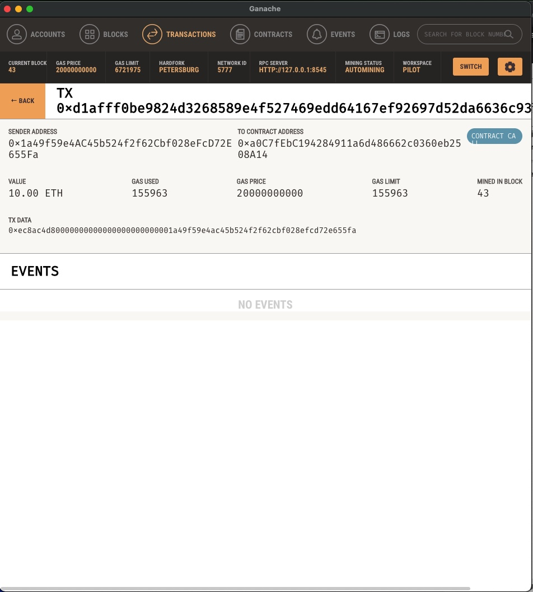
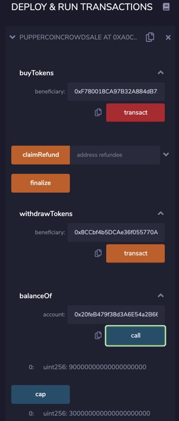
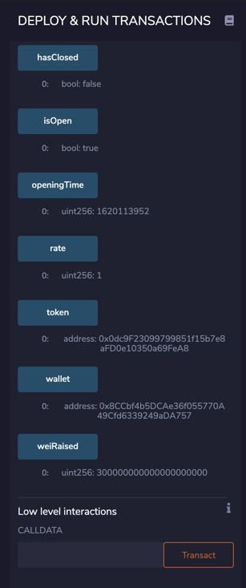
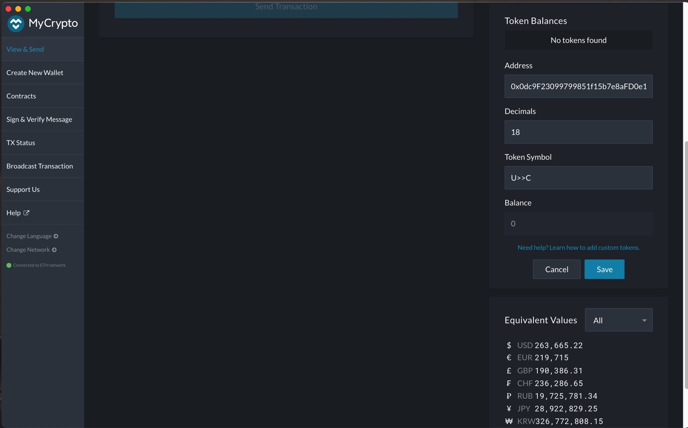
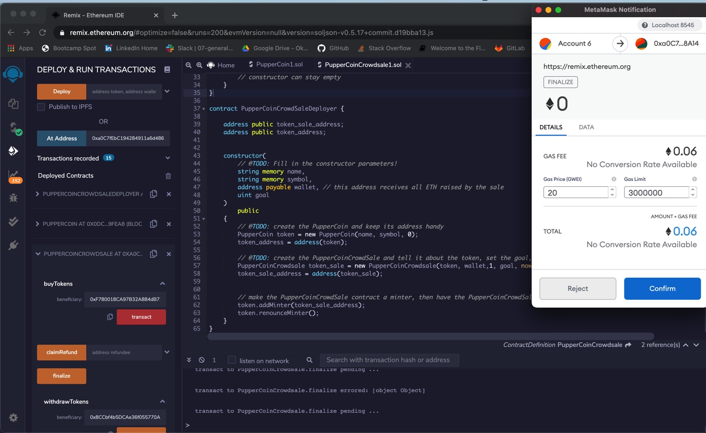

# Advanced Solidity - PupperCoin Token Crowdsale

# Background

This work describes the process of creating a mintable token and building a crowdsale contract to sell the token on the Ethereum blockchain. Some of the considerations required to ensure the token crowdsale is efficient and secure include clear definitions of the following:

* Name of token

* Set goal

* Conversion rate to ETH or other crytocurrency

* Firm sales period

* Maximum tokens as required

# Resources

* Wallet: Example https://metamask.io/index.html or https://mycrypto.com/

* Local blockchain or testnet: Example https://www.trufflesuite.com/ganache 

* Web-based Solidity IDE or similar: Example https://remix.ethereum.org/

# Completed Solidity Codes

[Token](Advanced_Solidity/PupperCoin1.sol)

[Token Crowdsale](Advanced_Solidity/PupperCoinCrowdsale1.sol)

# Testing the Crowdsale Contract

The smart contracts were written and compiled in Remix IDE, and then deployed using the PupperCoinDeployer contract to the local Ganache blockchain through MetaMask wallet. Addresses for the token and token crowdsales contracts were generated in the blockchain. Note that sample addresses generated in the Ganache local blockchain were used as account owner and token recipients as required to test the crowdsale.

### Some key addresses are as follows:

          Owner Wallet to Receive all ETH:    0x8CCbf4b5DCAe36f055770A49Cfd6339249aDA757

          Crowdsale Address:                  0xa0C7fEbC194284911a6d486662c0360eb2508A14

          Token Address:                      0x0dc9F23099799851f15b7e8aFD0e10350a69FeA8

### Some snapshots to test crowdsale functionalities are as follows:

#### Deployer contract  
   
   
   
   

#### Deployed token and token crowdsales contracts
  
  
   
   
#### Transfer 10 ETH to test crowdsale contract:

   
   
   
   

#### Purchase 300 UltraSuper Coin tokens worth 300 Ether
   
     
 

#### Custom token in MyCrypto

   
   
   
#### Finalize in 24 weeks 

   